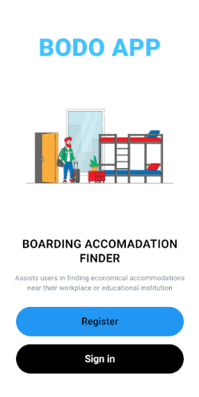
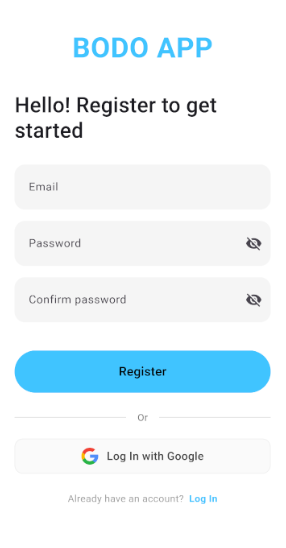
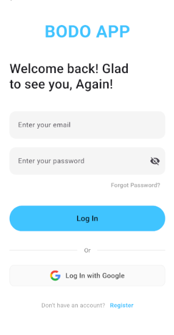
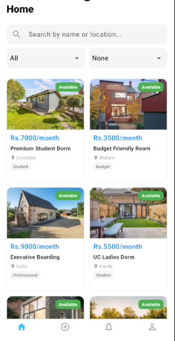

# BODO-APP | Boarding Accommodation Finder (Mobile App)

The **Boarding Accommodation App (BODO-APP)** mobile version connects users with affordable boarding options near their workplaces or universities. This mobile application provides a seamless and secure platform for users to search and register for accommodations, streamlining the boarding search and booking process.

## Screenshots
Below are the main UI screens of the BODO-APP:

<div align="center">     </div>

## Features

- **Search Listings**: Easily search for boarding accommodations by location, price, and proximity to universities or workplaces.
- **Secure Registration**: Register and book accommodations securely.
- **Responsive Mobile Design**: Optimized for a smooth experience on mobile devices.
- **User-Friendly Interface**: Simple and intuitive navigation to enhance user experience.

## Tech Stack

- **Frontend (Mobile)**: Flutter, Dart

## Getting Started

These instructions will help you set up the BODO-APP mobile application on your local machine for development and testing.

### Prerequisites

- **Flutter SDK** installed
- **Visual Studio Code** with the **Flutter** and **Dart** extensions
- **Git** for version control

### Installation

1. **Clone the repository**:
   ```bash
   git clone https://github.com/NipunaMadula/BODO-APP.git
   cd BODO-APP
   ```

2. **Install dependencies**:
   ```bash
   flutter pub get
   ```

3. **Run the application**:
   ```bash
   flutter run
   ```
   - Connect your device or start an emulator to view the app.

### Folder Structure

```
BODO-APP
├── lib
│   ├── main.dart             # Main entry point for the app
│   ├── screens               # Screens (Home, Search, Profile, etc.)
│   ├── widgets               # Reusable widgets
│   ├── models                # Data models
│   ├── services              # Backend service connections
│   └── utils                 # Utility functions and helpers
├── assets                    # Images, icons, and other assets
├── pubspec.yaml              # Project dependencies and metadata
└── README.md                 # Project README
```

### Available Scripts

- **`flutter run`**: Launches the app in debug mode.
- **`flutter build`**: Compiles the app for production (e.g., APK for Android).

## Contributing

Contributions to improve and enhance the BODO_APP mobile application are welcome. To contribute, please fork the repository and create a new branch for any feature or bug fix. After making changes, submit a pull request with a detailed description of the updates made. Thank you for helping improve this app!

## License

This project is licensed under the MIT License.

## Contact

For questions or collaboration, reach out to the project owner: **Nipuna Madula**
